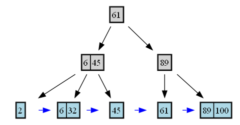

# Arbol B+ en C++

Este proyecto implementa un Arbol B+ dinamico en C++ que permite insertar, eliminar, imprimir y visualizar las hojas encadenadas del arbol. El arbol es visualizado con Graphviz, generando una imagen en formato `.png`.

## Caracteristicas

- Insercion de claves enteras
- Eliminacion de claves manteniendo la estructura del arbol
- Visualizacion de hojas encadenadas
- Generacion automatica de imagen del arbol (`arbol.png`)
- Manejo de subflujos (redistribucion o fusion)
- Recalculo automatico de claves separadoras
- Orden configurable al inicio

## Requisitos para la ejecusion

- Compilador C++ compatible con C++11 o superior
- Graphviz instalado (para `dot`)

## Uso

Compila el archivo:

```bash
g++ BPlussTree.cpp -o bpluss
./bpluss
```
## Menu de la aplicacion
1. Insertar
2. Eliminar
3. Imprimir
4. Mostrar arbol
5. Salir

## Ejemplo: 
### Inertar: 45, 61, 32, 89, 100, 2, 6
### A inicio tienes que ingresar el maximo de claves por nodo
Ingrese el numero maximo de claves por hoja (orden m-1): 2

### Luego puedes realizar cuanquier accion en el arbo B+
  
1. Insertar
2. Eliminar
3. Imprimir
4. Mostrar arbol
5. Salir
Opcion: 1
Valor a insertar: 45

1. Insertar
2. Eliminar
3. Imprimir
4. Mostrar arbol
5. Salir
Opcion: 1  
Valor a insertar: 61

1. Insertar
2. Eliminar
3. Imprimir
4. Mostrar arbol
5. Salir
Opcion: 1
Valor a insertar: 32

1. Insertar
2. Eliminar
3. Imprimir
4. Mostrar arbol
5. Salir
Opcion: 1
Valor a insertar: 89

1. Insertar
2. Eliminar
3. Imprimir
4. Mostrar arbol
5. Salir
Opcion: 1
Valor a insertar: 100

1. Insertar
2. Eliminar
3. Imprimir
4. Mostrar arbol
5. Salir
Opcion: 1
Valor a insertar: 2

1. Insertar
2. Eliminar
3. Imprimir
4. Mostrar arbol
5. Salir
Opcion: 1
Valor a insertar: 6

1. Insertar
2. Eliminar
3. Imprimir
4. Mostrar arbol
5. Salir
Opcion: 4
Imagen generada: arbol.png
### Con al opcion 4 nos va generar un .dot y un arbol.png
Puedes ver el archivo .dot generado [aqui](./arbol.dot)
